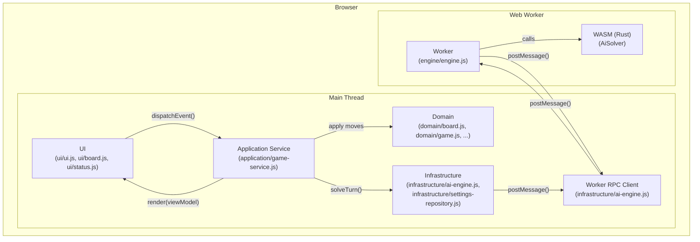
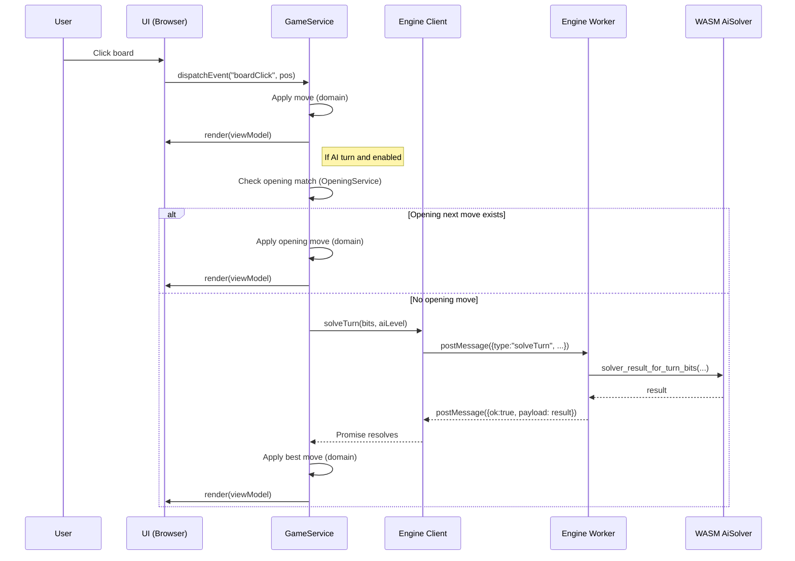

# Architecture

This document outlines the architecture of the Deft Reversi web application.

The application is a single-page application composed of a JavaScript frontend and a Rust-based AI engine compiled to WebAssembly (WASM). Heavy AI computation runs in a Web Worker to keep the UI responsive.

## High-Level Overview

1. **Frontend (JavaScript)**: UI rendering, user input, game loop orchestration, and domain state management.
2. **Web Worker**: Runs the AI engine in a separate thread and exposes a small message-based RPC surface (`solveTurn`).
3. **Backend (Rust/WASM)**: AI solver logic (search + evaluation) compiled to WASM and called from the worker.

## Visual Overview

### Component Diagram

### Sequence Diagram (Human move → AI move)

## Component Breakdown

### Frontend (JavaScript)

- `app/index.js`: Entry point; instantiates `GameService`.
- `app/application/game-service.js`: Orchestrates the game loop, serializes events, manages undo/redo, AI turns, hint jobs, and converts domain state into a UI view model.
- `app/domain/*`: Pure domain objects (immutable `Board`, `Game`, `GameRecord`, `Turn`, etc.) implementing rules via `BigInt` bitboards.
- `app/ui/*`: Canvas UI and modal UX. Communicates via `EventDispatcher` events.
- `app/application/settings-service.js`: Owns in-memory settings and default values (spec).
- `app/infrastructure/settings-repository.js`: Persists settings in `localStorage` (`deft-reversi-settings`) and migrates legacy `gameSettings`.
- `app/infrastructure/ai-engine.js`: Converts `BigInt` bitboards into `u32 low/high` parts for the worker boundary and performs worker RPC.
- `app/application/hint-service.js`: Iterative deepening hint evaluation (calls AI multiple times) with cancellation token.
- `app/application/opening-service.js`: Opening matching using `assets/opening.txt` and `ui/openings.js`.

### Web Worker Layer

- `app/infrastructure/ai-engine.js`: Worker RPC（requestId/timeout）とbitboard変換を含むAI呼び出しの統合レイヤー。
- `app/engine/engine.js`: Worker script. Initializes WASM (`app/pkg/*`), loads evaluation data (`assets/deft_eval_2024-01-27.json.gz`), and handles messages (currently `solveTurn`).

### Backend (Rust / WebAssembly)

- `wasm/src/lib.rs`: Exposes `AiSolver` and `solver_result_for_turn_bits(...)`.
- `app/pkg/*`: Output of `wasm-pack` placed under `app/pkg` so the web app can import it.

## Data Flow Example: AI Turn (Summary)

1. `GameService` decides it is AI’s turn.
2. `GameService` checks `OpeningService` for an opening match; if a next move exists, it plays that move.
3. Otherwise, `AiEngine.solveTurn(playerBits, opponentBits, aiLevel)` sends a worker request via postMessage.
4. The worker calls into WASM (`AiSolver`) and returns the best move/eval.
5. `GameService` applies the move (domain) and re-renders the UI.

---

# アーキテクチャ

このドキュメントは、Deft Reversi Web のアーキテクチャを概説します。

本アプリは、JavaScriptフロントエンドと、Rustで書かれたAIエンジンをWASMへコンパイルしたモジュールから構成されます。重い探索処理はWeb Worker内で実行します。

## ハイレベル概要

1. **フロントエンド（JavaScript）**: UI描画、入力、ゲーム進行（オーケストレーション）、ドメイン状態管理。
2. **Web Worker**: AI探索を別スレッドで実行し、メッセージベースのRPC（`solveTurn`）を提供。
3. **バックエンド（Rust/WASM）**: 探索・評価（Solver）をWASMとして提供し、Workerから呼び出す。

## ビジュアル概要

上部の **Component Diagram** / **Sequence Diagram** は、現行の実装（`GameService`中心、AIはWorker+WASM）に対応しています。

## コンポーネント分割

### フロントエンド（JavaScript）

- `app/index.js`: エントリーポイント。`GameService` を生成します。
- `app/application/game-service.js`: オーケストレーター。イベント処理の直列化、ゲーム進行、Undo/Redo、AI手番、ヒント計算を統括し、UIへ `render(viewModel)` します。
- `app/domain/*`: ドメイン（`Board`, `Game`, `GameRecord`, `Turn` など）。盤面ルールを `BigInt` bitboard で実装し、基本的に不変（immutable）として扱います。
- `app/ui/*`: UI（Canvas描画、モーダル、クリック処理）。`EventDispatcher` 経由でイベントを発火します（ルール判断は持たない）。
- `app/events.js`: `UI` と `GameService` を疎結合にするイベントディスパッチャ。
- `app/application/settings-service.js`: 設定のインメモリ状態とデフォルト値（仕様）を保持します。
- `app/infrastructure/settings-repository.js`: 設定を `localStorage` に永続化します。
  - 正本キー: `deft-reversi-settings`
  - 旧キー: `gameSettings`（読み込み時に移行して削除）
- `app/infrastructure/ai-engine.js`: `BigInt` の bitboard を Worker境界向けに `u32 low/high` へ分割し、Worker RPCを含めてAI呼び出しを抽象化します。
- `app/application/hint-service.js`: 反復深化のヒント計算（合法手ごとに複数回AIを呼ぶ）。キャンセル用トークンを持ちます。
- `app/application/opening-service.js`: 定石照合。`assets/opening.txt` と `ui/openings.js` の定義を用いて「現在の定石名/次の推奨手」を返します。

### Web Worker レイヤー

- `app/infrastructure/ai-engine.js`: Worker RPC（`requestId`/timeout）とbitboard変換を含むAI呼び出しの統合レイヤーです。
- `app/engine/engine.js`: Worker本体。WASM初期化（`app/pkg/*`）、評価データのロード（`assets/deft_eval_2024-01-27.json.gz`）、メッセージ処理（現状 `solveTurn`）を行います。

### バックエンド（Rust/WASM）

- `wasm/src/lib.rs`: `AiSolver` と `solver_result_for_turn_bits(...)` を公開します。
- `app/pkg/*`: `wasm-pack` の出力（JSラッパ + WASMバイナリ）。Web側はここをimportして利用します。

## データフロー例（AI手番）

1. `GameService` がAI手番かどうかを判定します。
2. `GameService` が `OpeningService` で定石照合し、次の推奨手があればそれを着手します。
3. 定石がない場合は `AiEngine.solveTurn(playerBits, opponentBits, aiLevel)` がWorkerへ要求を送ります。
4. Worker（`engine/engine.js`）がWASMの `AiSolver.solver_result_for_turn_bits(...)` を呼び出して探索し、結果を返します。
5. `GameService` が最善手をドメインで適用し、`UI.render(viewModel, ...)` により再描画します。
