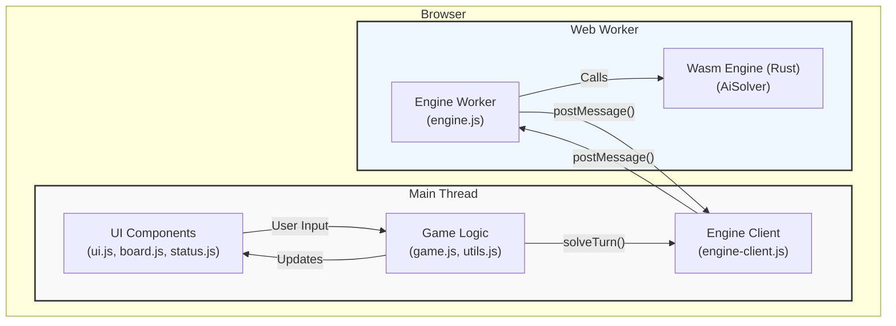
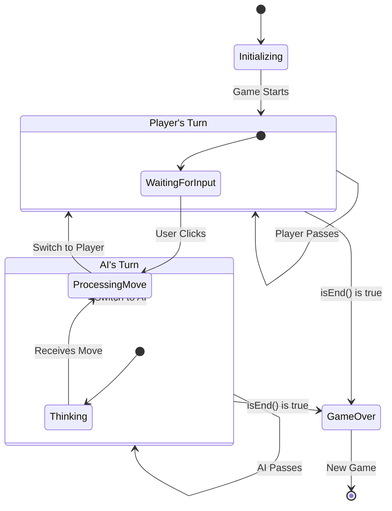
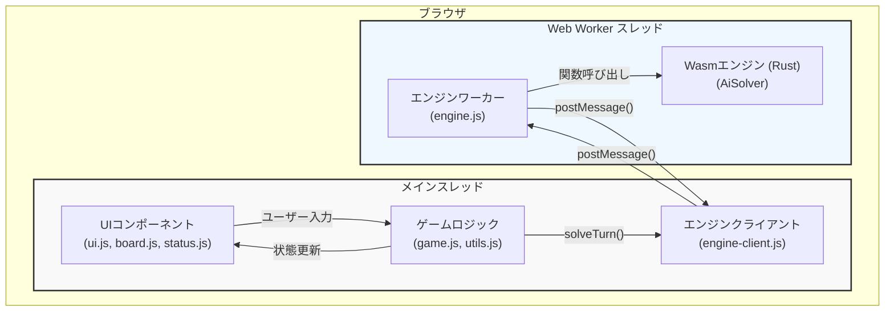
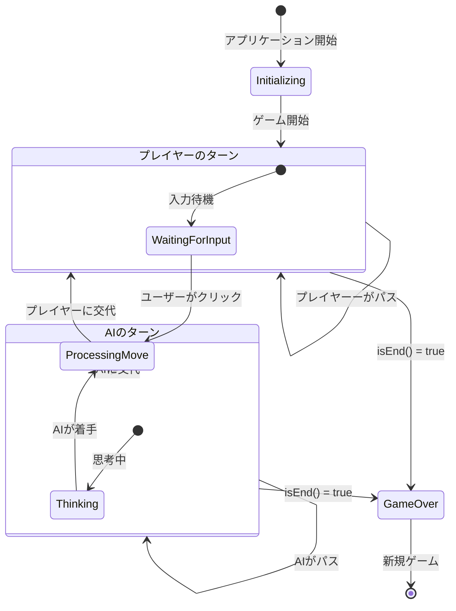

# Architecture

This document outlines the architecture of the Deft Reversi web application.

The application is a single-page application composed of a JavaScript frontend and a Rust-based AI engine compiled to WebAssembly (WASM).

## High-Level Overview

1.  **Frontend (JavaScript)**: Handles all UI rendering, user input, and game state management.
2.  **Web Worker**: Runs the AI engine in a separate thread to prevent the UI from freezing during AI calculations.
3.  **Backend (Rust/WASM)**: Contains the core AI logic for calculating the best move.

## Visual Overview

### Component Diagram

This diagram shows the static structure of the application and how the main components are organized and interact.



### Sequence Diagram (Data Flow)

This diagram illustrates the data flow when a user makes a move, followed by an AI turn.

```mermaid
sequenceDiagram
    participant User
    participant UI (Browser)
    participant GameLogic (game.js)
    participant EngineClient (engine-client.js)
    participant EngineWorker (engine.js)
    participant WasmEngine (AiSolver)

    User->>+UI (Browser): Clicks board to make a move
    UI (Browser)->>+GameLogic (game.js): handleHumanMove(position)
    GameLogic (game.js)->>GameLogic (game.js): applyMove()
    GameLogic (game.js)->>UI (Browser): render()
    UI (Browser)-->>-User: Display board after human move

    Note right of GameLogic (game.js): Switches to AI's turn
    GameLogic (game.js)->>+EngineClient (engine-client.js): solveTurn(boardState)
    EngineClient (engine-client.js)->>+EngineWorker (engine.js): postMessage({type: 'solveTurn', ...})
    EngineWorker (engine.js)->>+WasmEngine (AiSolver): solver_result_for_turn_bits()
    WasmEngine (AiSolver)-->>-EngineWorker (engine.js): returns bestMove
    EngineWorker (engine.js)-->>-EngineClient (engine-client.js): postMessage({payload: bestMove})
    EngineClient (engine-client.js)-->>-GameLogic (game.js): Promise resolves with bestMove
    GameLogic (game.js)->>GameLogic (game.js): applyMove(bestMove)
    GameLogic (game.js)->>UI (Browser): render()
    UI (Browser)-->>-User: Display board after AI move
```

### State Diagram (Game Lifecycle)

This diagram shows the lifecycle of the game, transitioning between different states based on player actions and game logic.



## Component Breakdown

### 1. Frontend (JavaScript)

The frontend is responsible for the user-facing parts of the application.

-   `index.js`: The main entry point. It initializes the `Game` object to start the application.
-   `game.js`: The central orchestrator. The `Game` class manages the game loop, history, AI turns, and coordinates between the UI and the engine.
-   `ui.js`: The main UI class. It manages the overall layout, modals, and delegates drawing to `BoardUI` and `StatusUI`.
-   `board.js`: The `BoardUI` class is responsible for all drawing on the main board canvas, including the grid, stones, and hints.
-   `status.js`: The `StatusUI` class handles the drawing of the status area, which includes scores, player names, and action buttons.
-   `events.js`: A simple `EventDispatcher` class that is used to decouple components, allowing the `Game` logic and `UI` to communicate without direct dependencies.
-   `utils.js`: Contains pure utility functions for the game logic, primarily for bitboard manipulation (calculating legal moves, applying moves, etc.).

### 2. Web Worker Layer

To ensure the user interface remains responsive while the AI is thinking, the WASM engine is run inside a Web Worker.

-   `engine-client.js`: A client-side wrapper (`Engine` class) that communicates with the Web Worker. It provides a simple Promise-based API (e.g., `solveTurn()`) to the `Game` class. It handles sending requests and receiving responses.
-   `engine.js`: The script that runs inside the Web Worker. It imports and initializes the WASM module (`AiSolver`), loads the necessary evaluation data, and listens for messages from `engine-client.js`. Upon receiving a request, it calls the corresponding WASM function and posts the result back.

### 3. Backend (Rust / WebAssembly)

The core AI logic is implemented in Rust for performance and compiled to WebAssembly.

-   `src/lib.rs`: The main Rust source file. It defines the `AiSolver` struct and the logic for evaluating board positions and finding the best move. It exposes methods that can be called from JavaScript.
-   `pkg/deft_reversi_web.js` & `pkg/deft_reversi_web_bg.wasm`: The JavaScript wrapper and the binary WASM file generated by `wasm-pack`. The `engine.js` worker imports the wrapper to interact with the compiled Rust code.

## Data Flow Example: AI's Turn

1.  The `Game` class determines it's the AI's turn.
2.  `game.js` calls `this.engine.solveTurn()` via the `engine-client.js` instance.
3.  `engine-client.js` sends a message containing the current board state to `engine.js` (the worker).
4.  `engine.js` receives the message and calls the `ai.solver_result_for_turn_bits()` method on the WASM `AiSolver` instance.
5.  The Rust code runs, finds the best move, and returns the result to `engine.js`.
6.  `engine.js` posts the result back to the main thread.
7.  `engine-client.js` receives the message and resolves the Promise that `game.js` is awaiting.
8.  `game.js` receives the best move, updates the game state by calling `applyMove()`.
9.  The `render()` method is called, which updates the `BoardUI` and `StatusUI` to reflect the new state on the screen.

---

# アーキテクチャ

このドキュメントは、Deft Reversi ウェブアプリケーションのアーキテクチャについて概説します。

このアプリケーションは、JavaScriptフロントエンドと、WebAssembly（WASM）にコンパイルされたRustベースのAIエンジンで構成されるシングルページアプリケーションです。

## ハイレベル概要

1.  **フロントエンド (JavaScript)**: すべてのUIレンダリング、ユーザー入力、およびゲーム状態管理を担当します。
2.  **Web Worker**: AIの計算中にUIがフリーズするのを防ぐため、別のスレッドでAIエンジンを実行します。
3.  **バックエンド (Rust/WASM)**: 最善手を計算するためのコアAIロジックを含みます。

## ビジュアル概要

### コンポーネント図

この図は、アプリケーションの静的な構造と、主要なコンポーネントがどのように構成され、相互作用するかを示しています。



### シーケンス図 (データフロー)

以下の図は、ユーザーが着手し、その後AIが応答するまでのデータフローを示しています。

```mermaid
sequenceDiagram
    participant User as ユーザー
    participant UI (Browser) as UI (ブラウザ)
    participant GameLogic (game.js) as ゲームロジック
    participant EngineClient (engine-client.js) as エンジンクライアント
    participant EngineWorker (engine.js) as エンジンワーカー
    participant WasmEngine (AiSolver) as WASMエンジン

    User->>+UI (Browser): 盤面をクリック (着手)
    UI (Browser)->>+GameLogic (game.js): handleHumanMove(position)
    GameLogic (game.js)->>GameLogic (game.js): applyMove()
    GameLogic (game.js)->>UI (Browser): render()
    UI (Browser)-->>-User: ユーザーの着手後の盤面を表示

    Note right of GameLogic (game.js): AIのターンに切り替わる
    GameLogic (game.js)->>+EngineClient (engine-client.js): solveTurn(boardState)
    EngineClient (engine-client.js)->>+EngineWorker (engine.js): postMessage({type: 'solveTurn', ...})
    EngineWorker (engine.js)->>+WasmEngine (AiSolver): solver_result_for_turn_bits()
    WasmEngine (AiSolver)-->>-EngineWorker (engine.js): 最善手を返す
    EngineWorker (engine.js)-->>-EngineClient (engine-client.js): postMessage({payload: bestMove})
    EngineClient (engine-client.js)-->>-GameLogic (game.js): Promiseが最善手で解決される
    GameLogic (game.js)->>GameLogic (game.js): applyMove(bestMove)
    GameLogic (game.js)->>UI (Browser): render()
    UI (Browser)-->>-User: AIの着手後の盤面を表示
```

### 状態遷移図 (ゲームライフサイクル)

この図は、プレイヤーのアクションやゲームロジックに基づいて、ゲームが異なる状態にどのように移行するかを示しています。



## コンポーネント分割

### 1. フロントエンド (JavaScript)

フロントエンドは、アプリケーションのユーザー向け部分を担当します。

-   `index.js`: メインのエントリーポイント。`Game`オブジェクトを初期化してアプリケーションを開始します。
-   `game.js`: 中央のオーケストレーター。`Game`クラスがゲームループ、履歴、AIのターンを管理し、UIとエンジンの間の調整を行います。
-   `ui.js`: メインのUIクラス。全体のレイアウト、モーダルを管理し、描画を`BoardUI`と`StatusUI`に委任します。
-   `board.js`: `BoardUI`クラスは、グリッド、石、ヒントを含むメインのゲームボードキャンバス上のすべての描画を担当します。
-   `status.js`: `StatusUI`クラスは、スコア、プレイヤー名、アクションボタンを含むステータス領域の描画を処理します。
-   `events.js`: コンポーネントを疎結合にするために使用されるシンプルな`EventDispatcher`クラス。これにより、`Game`ロジックと`UI`が直接の依存関係なしに通信できます。
-   `utils.js`: ゲームロジックのための純粋なユーティリティ関数を含み、主にビットボード操作（合法手の計算、手の適用など）に使用されます。

### 2. Web Worker レイヤー

AIが思考している間もユーザーインターフェースの応答性を確保するため、WASMエンジンはWeb Worker内で実行されます。

-   `engine-client.js`: Web Workerと通信するクライアントサイドのラッパー（`Engine`クラス）。`Game`クラスにシンプルなPromiseベースのAPI（例：`solveTurn()`）を提供します。リクエストの送信とレスポンスの受信を処理します。
-   `engine.js`: Web Worker内で実行されるスクリプト。WASMモジュール（`AiSolver`）をインポートして初期化し、必要な評価データをロードし、`engine-client.js`からのメッセージをリッスンします。リクエストを受け取ると、対応するWASM関数を呼び出し、結果をポストします。

### 3. バックエンド (Rust / WebAssembly)

コアのAIロジックは、パフォーマンスのためにRustで実装され、WebAssemblyにコンパイルされています。

-   `src/lib.rs`: メインのRustソースファイル。`AiSolver`構造体と、盤面評価および最善手を見つけるためのロジックを定義します。JavaScriptから呼び出すことができるメソッドを公開します。
-   `pkg/deft_reversi_web.js` & `pkg/deft_reversi_web_bg.wasm`: `wasm-pack`によって生成されたJavaScriptラッパーとバイナリWASMファイル。`engine.js`ワーカーは、コンパイルされたRustコードと対話するためにこのラッパーをインポートします。

## データフローの例：AIのターン

1.  `Game`クラスがAIのターンであると判断します。
2.  `game.js`が`engine-client.js`インスタンスを介して`this.engine.solveTurn()`を呼び出します。
3.  `engine-client.js`が現在のボード状態を含むメッセージを`engine.js`（ワーカー）に送信します。
4.  `engine.js`がメッセージを受信し、WASMの`AiSolver`インスタンスの`ai.solver_result_for_turn_bits()`メソッドを呼び出します。
5.  Rustコードが実行され、最善手を見つけて結果を`engine.js`に返します。
6.  `engine.js`が結果をメインスレッドにポストします。
7.  `engine-client.js`がメッセージを受信し、`game.js`が待機しているPromiseを解決します。
8.  `game.js`が最善手を受け取り、`applyMove()`を呼び出してゲーム状態を更新します。
9.  `render()`メソッドが呼び出され、`BoardUI`と`StatusUI`を更新して画面に新しい状態を反映させます。
