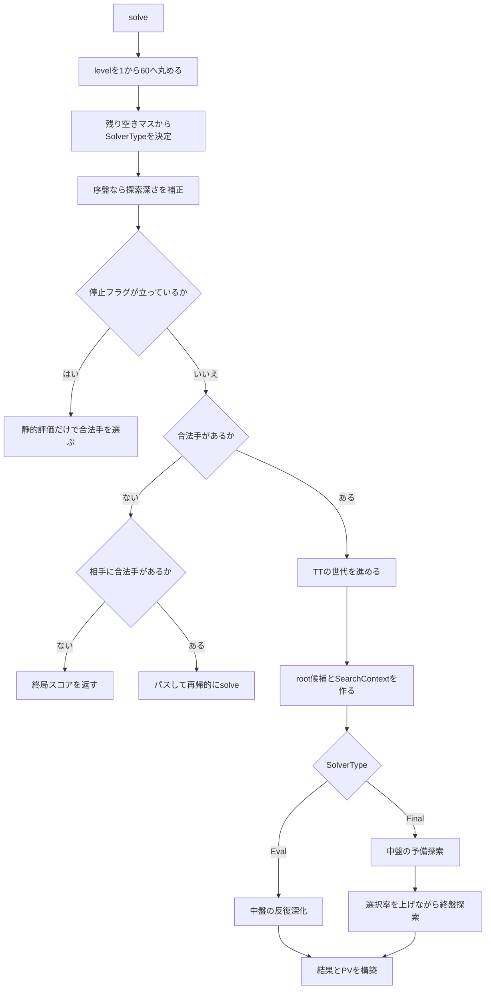

# `solver.rs` 読解ガイド

対象: [`deft-reversi-engine/src/search/solver.rs`](../deft-reversi-engine/src/search/solver.rs)

## 1. このファイルの役割

`solver.rs` は探索アルゴリズムそのものではなく、探索全体を組み立てる
**探索ドライバ**である。主な責務は次のとおり。

- 指定レベルと残り空きマス数から探索方式を決める
- 中盤探索と終盤探索を適切な順序で実行する
- 反復深化とアスピレーション窓を制御する
- root の合法手を並べ替え、前段階の最善手を次段階へ引き継ぐ
- 探索の中断、統計収集、PV（読み筋）復元を処理する

実際に探索木を再帰的にたどる処理は、次のモジュールへ委譲している。

| 呼び出し | 役割 |
|---|---|
| `pvs_eval` | 中盤の PVS 探索 |
| `nws_eval` | 中盤の Null Window Search |
| `pvs_final` | 終盤の PVS 探索 |
| `nws_final` | 終盤の Null Window Search |
| `solve_score` | 終局盤面の確定スコア計算 |

したがって、このファイルを読むときは「探索木の各ノードをどう評価するか」より、
「どの探索を、どの順序と探索窓で呼ぶか」に注目すると理解しやすい。

## 2. 全体の処理フロー

通常利用する入口は `Solver::solve(board, level)` である。



重要なのは、`SolverType::Final` が選ばれても、すぐに完全読みを始めるわけでは
ない点である。まず浅い中盤探索で予測スコアと着手順を作り、その後に終盤探索へ
移る。高価な完全読みの前に良い着手順を用意し、alpha-beta カットを増やすためである。

## 3. 主要な型

### `Solver`

探索を複数回実行するための共有資源を保持する。

| フィールド | 内容 |
|---|---|
| `evaluator` | 局面の本評価に使う評価器 |
| `ordering_evaluator` | 着手順序付けに使う評価器 |
| `mpc` | Multi Prob Cut の設定 |
| `tt` | 通常の置換表 |
| `pv_tt` | PV 復元を優先する小さな置換表 |
| `stop` | 外部から探索を中断する共有フラグ |

評価器や置換表を `Arc` で保持するのは、探索コンテキストへ安価に渡し、複数回の
探索で同じ資源を再利用するためである。

### `SolverOptions`

- `tt_capacity`: 置換表の容量を MiB 単位で指定する
- `stop`: 呼び出し側からセットできる中断フラグ

### `SolverType`

実際に採用された探索構成を表す。

```rust
Eval(depth, selectivity_lv)
Final(selectivity_lv)
```

- `Eval`: 指定深さまで読む中盤探索
- `Final`: 終局まで読む終盤探索

`selectivity_lv` は MPC による選択的探索の強さを表す。値が小さいほど強く枝刈りし、
探索量を減らす代わりに読み抜けの可能性が増える。最大値
`SELECTIVITY_LV_MAX` は MPC を使わない探索であり、終盤では完全読みに相当する。

### root候補配列

root の合法手は `(u8, Board)` のタプルで保持する。`.0` が盤面座標、`.1` が着手後の
子局面である。

`candidates[0]` は常に「現在分かっている最善手」という規約になっている。
探索後に最善候補を先頭へ移すことで、次の反復深化や次の選択率段階では、その手を
最初に探索できる。

### `SearchContext`

1 回の探索中に共有する評価器、MPC、置換表、統計、中断状態をまとめた型。
`solve_eval`、`solve_final`、`solve` の各入口で生成している。

`SearchContext` は `SearchStats` を可変借用する。そのため `solve` では、結果の構築前に
`drop(search)` を呼び、統計への借用を明示的に終了している。

## 4. `solve` の入口処理

### 4.1 レベルと探索構成

`level_to_solver_type` は、レベルと残り空きマス数から `SolverType` を選ぶ。

- レベル 1〜10では、空きマスが `2 * level` 以下なら完全読みへ移る
- レベル 11〜35では、レベル帯ごとの閾値表を使う
- レベル 36〜59では、レベルからの相対差で選択率を決める
- レベル 60では常に完全読みする

閾値表の各要素は次の意味を持つ。

```text
(この空きマス数以下なら, この選択率で終盤探索する)
```

どの閾値にも該当しなければ `Eval(level, ITERATIVE_SELECTIVITY_MIN)` となる。

### 4.2 序盤補正

`SolverType::adjusted_for_opening` は、着手数が 20 未満かつ中盤探索深さが 14 より
大きい場合、深さを 4 減らす。序盤では評価関数の精度が比較的粗く、深く読む費用に
見合う改善が得にくいためである。

選択的探索を使う構成では、同時に選択率レベルを 3 へ調整する。

### 4.3 停止、パス、終局

探索開始前に停止フラグが立っている場合、`fallback_move` が各合法手を 1 手だけ進め、
静的評価が最大の手を返す。中断要求があっても呼び出し側へ合法手を返すためである。

合法手がない場合は次のように処理する。

1. 相手に合法手があれば、盤面をパスして `solve` を呼び直す
2. 返されたスコアの符号を反転する
3. root 自身は着手していないため `best_move` を `None` にする
4. 相手にも合法手がなければ `solve_score` で終局スコアを返す

符号反転が必要なのは、すべてのスコアが「その局面の手番側から見た値」だからである。

### 4.4 置換表の世代

探索開始時に `tt` と `pv_tt` の世代を進める。同じ `Solver` は複数局面で再利用される
ため、以前の局面のエントリを置換しやすくし、現在の探索結果を優先して残す。

## 5. 中盤探索プラン

`SolverType::Eval` の場合、`solve` の `match` 分岐から
`iterative_deepening_eval` を呼ぶ。

### 5.1 反復深化

目標深さと同じ偶奇を保ちながら、原則として深さ 5 または 6 から 2 ずつ深くする。

```text
目標深さ 20: 6 → 8 → 10 → ... → 20
目標深さ 19: 5 → 7 → 9  → ... → 19
```

直前の探索から次の情報を引き継ぐ。

- 最善スコア: 次のアスピレーション窓の中心
- `candidates[0]`: 次の探索で最初に読む手
- TT: より深い探索での着手順序付けやカットに利用

深さ 16 より深い場合は初期窓幅を 2、それ以前は 6 とする。深い探索ほど前段階の
予測値が安定しやすいため、狭い窓から始められる。

## 6. 終盤探索プラン

`SolverType::Final` の場合は、`solve` の終盤分岐が次の二段階を実行する。

### 6.1 中盤評価による予備探索

まず次の深さまで中盤探索を行う。

```rust
(n_empties - 8).clamp(2, 24).min(level)
```

これは完全読みのおよそ 8 手前まで評価探索を行う設定である。ここで得た最善手と
予測スコアを、終盤探索の初期値に使う。

### 6.2 選択率を段階的に上げる

`first_final_selectivity` は、目標値と 2 の小さい方から探索を始める。その後、
`next_final_selectivity` が選択率を目標値まで上げる。

```text
安価な選択的探索 → より高精度な選択的探索 → 完全読み
```

残り空きマスが少ない局面では、中間段階を実行しても着手順改善の利益が小さい。
そのため `next_final_selectivity` は Edax と同様の空きマス閾値を使い、高価な中間段階を
飛ばして目標値へ進む。

各段階では、前段階のスコアを中心としたアスピレーション窓を使う。

## 7. アスピレーション探索

アスピレーション探索は、予想スコアの周辺だけを狭い alpha-beta 窓で読む手法である。
窓が狭いほどカットが増えやすいが、真の値が窓外にあると再探索が必要になる。

### 7.1 基本動作

予測値を `predict = 10`、初期幅を `2` とすると、最初の窓は概ね次のようになる。

```text
alpha = 8, beta = 12
```

結果による処理は次のとおり。

| 結果 | 意味 | 次の処理 |
|---|---|---|
| `alpha < score < beta` | 窓内に収まった | その反復を終了 |
| `score <= alpha` | fail-low | 左側の幅を倍にする |
| `score >= beta` | fail-high | 右側の幅を倍にする |

`grow_aspiration_side` は失敗した側を倍にし、反対側を 0 にする。新しく得たスコアを
一方の窓端として固定し、必要な方向だけを広げるためである。

深さまたは残り空きマスが `ASPIRATION_FULL_WINDOW_DEPTH` 以下なら、再探索の費用を
避けるため、最初から `[-SCORE_MAX, SCORE_MAX]` の全幅で探索する。

### 7.2 中断時の扱い

アスピレーション探索中に停止した場合、途中の探索で変化した `candidates[0]` を
`restore_candidate_front` で元に戻し、直前に確定していたスコアを返す。

未完了の探索結果を最善手として公開しないための処理である。

### 7.3 終盤スコアの偶数化

終局時に空きマスが残った場合、このエンジンの `solve_score` は空きマスを勝者側へ
加算する。結果としてスコア計算上の石数合計は 64 になり、石差は必ず偶数になる。
そのため終盤のアスピレーション窓では、`even_floor` と `even_ceil` で窓端を外側の
偶数へ丸める。

これにより、発生しない奇数スコアだけを区別する無駄な再探索を避ける。

## 8. root の PVS

`search_root_eval_window` と `search_root_final_window` は、root の各合法手を探索する。

基本手順は次のとおり。

1. `candidates[0]` を現在の `[alpha, beta]` 窓全体で PVS 探索する
2. 得られた値で `alpha` を更新する
3. 2 手目以降を Null Window Search で安く確認する
4. `alpha` を超えた候補だけ現在の `[alpha, beta]` 窓で読み直す
5. 最善手を `candidates[0]` へ移す

子局面は相手番なので、探索結果の符号を反転して root 側のスコアへ戻す。

```rust
score = -pvs_eval(child, -beta, -alpha, ...)
```

この形は negamax の基本変換である。

### fail-soft

この実装は fail-soft であり、fail-low 時に必ず `alpha`、fail-high 時に必ず `beta` を
返すのではなく、探索で実際に得た窓外の値を返す。次のアスピレーション窓を決める
材料が増え、窓を適切な方向へ広げやすくなる。

## 9. 終盤 root の上下限管理

`aspiration_search_final` は、盤面座標ごとに `RootBound` を 64 個持つ。

```rust
struct RootBound {
    lower: i32,
    upper: i32,
}
```

窓探索の結果は次のように保存される。

| 条件 | 保存する情報 |
|---|---|
| `score <= alpha` | 上限 `upper` |
| `score >= beta` | 下限 `lower` |
| `alpha < score < beta` | 確定値として上下限の両方 |

アスピレーション窓を広げて同じ手を再探索するとき、既知の上下限だけでカットできる
場合は探索を省略する。省略できない場合でも、既知の範囲に合わせて探索窓を縮める。

この上下限を利用するのは `selectivity_lv == SELECTIVITY_LV_MAX` の場合だけである。
選択的探索の値は厳密な上下限として保証できないため、完全読みの枝刈りには使わない。

## 10. 単発探索 API

`solve_eval` と `solve_final` は、主に内部テストやデバッグで使う単発 API である。

- `solve_eval`: 指定深さで `search_root_eval` を 1 回実行する
- `solve_final`: `search_root_final` で終局まで読む

これらは高レベル API の `solve` と異なり、レベル変換、反復深化、段階的な終盤探索を
行わない。探索プリミティブを直接確認したい場合に向いている。

## 11. 結果と PV の構築

`result_from_parts` が内部結果を `SolverResult` へ変換する。

| フィールド | 内容 |
|---|---|
| `best_move` | 最善手。パスまたは終局なら `None` |
| `score` | 現在の手番側から見たスコア |
| `solver_type` | 実際に使用した探索構成 |
| `nodes` | `eval_search_leaf_nodes + final_search_nodes` |
| `leaf_nodes` | 中盤と終盤の葉ノード数の合計 |
| `pv` | TT から復元した着手列 |
| `aborted` | 停止フラグによって中断されたか |

PV は、まず `pv_tt`、該当エントリがなければ通常の `tt` をたどって復元する。
途中にパスがあれば盤面だけをパスし、PV の着手列には追加しない。

次の場合は復元を終了する。

- TT に次の手がない
- TT の手が現在の合法手ではない
- 終局した
- 探索深さに対応する最大長へ達した

## 12. 中断の設計

中断には `Arc<AtomicBool>` を使う。

1. 呼び出し側がフラグを `true` にする
2. 再帰探索が `SearchContext` 経由でフラグを確認する
3. `SearchContext::is_aborted()` が中断状態を保持する
4. 各探索ループが直前の確定結果を維持して上位へ戻る
5. 最終結果の `aborted` が `true` になる

停止フラグは「ただちに空の結果を返す」のではなく、可能な限り合法な最善手と直前の
確定スコアを残すよう設計されている。

## 13. 診断用の環境変数

| 環境変数 | 出力内容 |
|---|---|
| `DEFT_SEARCH_TRACE` | 探索段階、スコア、ノード数、MPC・安定石カット数 |
| `DEFT_PHASE_TIME` | 中盤反復深化、選択的終盤、完全読みの所要時間とノード数 |
| `DEFT_MPC_STATS` | MPC の試行数とカット数 |
| `DEFT_STABILITY_STATS` | 安定石判定の試行数とカット数 |

置換表競合統計が有効な場合は、上記とは別に `TTSTATS` も出力される。

## 14. 推奨する読み順

最初から行単位で読むより、次の順で関数を追うと理解しやすい。

1. `SolverType` / `SolverResult` / root候補配列
2. `Solver::solve`
3. `level_to_solver_type`
4. `iterative_deepening_eval`
5. `aspiration_search_eval` / `aspiration_search_final`
6. `search_root_eval_window` / `search_root_final_window`
7. `RootBound` / `search_root_final_candidate`
8. `result_from_parts` / `restore_pv`

その後、探索木内部の詳細を知りたい場合に `pvs_eval`、`nws_eval`、`pvs_final`、
`nws_final` の実装へ進むとよい。

## 15. 変更時に守るべき不変条件

このファイルを変更するときは、少なくとも次の条件を保つ必要がある。

- `candidates` が空の状態でアスピレーション探索を呼ばない
- `candidates[0]` は最後に確定した最善手である
- 中断した未完了探索で、直前の確定手とスコアを壊さない
- パス時は盤面視点が入れ替わるため、戻り値の符号を反転する
- 選択的終盤探索で得た `RootBound` を完全読みの厳密な上下限として使わない
- 終盤のアスピレーション窓は偶数境界を維持する
- `SearchContext` を破棄してから、借用元の `SearchStats` で結果を作る
- `SolverResult::best_move` に非合法手を入れない

## 16. 関連テスト

`solver.rs` 内のテストは、主に次を保証している。

- 置換表の世代更新
- `RootBound` の上下限統合
- 選択的探索時に `RootBound` を誤用しないこと
- アスピレーション窓の拡張
- 終盤窓の偶数丸め
- 反復深化の開始深さと偶奇
- 終盤選択率の段階スキップ
- レベルから探索構成への切替境界
- 序盤補正
- 中盤・終盤探索が合法手と正しいスコアを返すこと
- 中断後も合法手を返すこと
- TT から複数手の PV を復元できること

対象テストだけを実行するコマンド:

```bash
cargo test -p deft_reversi_engine search::solver::tests
```
